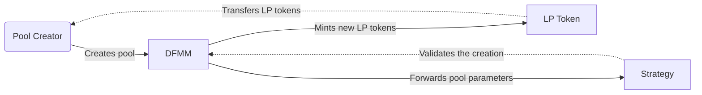
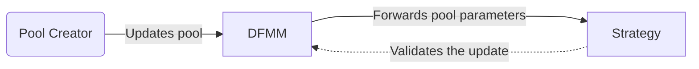
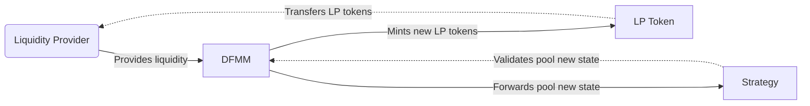

# DFMM

This repository contains the smart contracts source code for the DFMM protocol. 

## What is DFMM?

The DFMM protocol is a novel portfolio management system designed to leverage external strategy contracts. This system separates the operational logic and the mathematical model: the `DFMM` core contract completely relies on the strategies to validate the state of each interaction. On the other hand, this core contract acts as a single entry point and performs all the operations, such as:
- Passing the input data to the strategies for validation
- Safely transferring the assets between the users and the core contract
- Tracking the reserves in a singleton pattern
- Tokenizing the liquidity and distributing the LP tokens to the users

## Contracts Architecture

The DFMM protocol relies on two main components: the `DFMM` core contract and the strategies.

### DFMM

This contract is the core of the protocol and is the single entry point for all the user interactions. It also handles all the following operations on the behalf of the strategies:
- Deploying an ERC20 token for each new pool (using the minimal proxy pattern)
- Wrapping / unwrapping native ETH when necessary
- Transferring the assets from or to the user's wallet
- Preventing reentrancy by locking the contract during the operations
- Emitting according events for each interaction
- Keeping track of the reserves for each pool

### Strategies

The strategies are the mathematical models that define the logic of the pools. They all implement a specific trading curve (for example `xy=k`) and are responsible for validating the state of the pool at each interaction.

### Initializing and updating a pool

#### Creating a new pool



#### Updating a pool



### Providing liquidity

#### Allocating



### Arbitrage

## Development

### Installation

This repository uses Foundry, be sure to have it installed or run the following command to install it:

```bash
curl -L https://foundry.paradigm.xyz | bash
```

Then clone the repository along with its dependencies:

```bash
git clone git@github.com:primitivefinance/DFMM.git --recurse-submodules
```

One last step is to set up the environment variables, run this to copy the template:

```bash
cp .env.example .env
```

Then populate the `.env` file with the required environment variables.

### Testing

To run all the tests, simply run the following command:

```bash
forge t
```

Learn more about our testing suite [here](./test/README.md).

### Deployment

You can deploy the contracts with the following command:

```bash
$ forge script ./src/script/Deployment.s.sol --rpc-url $OPTIMISM_SEPOLIA_RPC_URL --broadcast --verify -vvv
```

### Arbiter Security Report
To build the arbiter run
```bash
$ make tex
```

## Current Deployments

The DFMM protocol is currently deployed on the following networks:

| Designation | Network | Address |
|---|---|---|
| `DFMM` | Optimism Sepolia | `0x89a023e3cbccf1c96F00749F87D24C9B1124BaE1` |
| `G3M` | Optimism Sepolia | `0xB5C2c5a4000FB230b289bB54f8b48F4dd8075F3D` |
| `LogNormal` | Optimism Sepolia | `0x6A74a571c638dDDF13ae52F48A37D1019B916520` |

## Terminology

These terms are used to name specific variables throuhout the codebase and the documentation. They are noted here for clarity and are expected to be reused in the future by strategy developers or contributors.

- The prefix `delta` is used to denote the amount of tokens or liquidity to be added or removed from a pool: `deltaX`, `deltaY`, `deltaLiquidity`.
- The prefix `adjusted` is used to denote the amount of tokens or liquidity after the addition or removal of liquidity: `adjustedReserveX`, `adjustedReserveY`, `adjustedLiquidity`.

| Term | Definition |
|---|---|
| `reserveX` | The amount of token X held by a pool |
| `reserveY` | The amount of token Y held by a pool |
| `liquidity` | The amount of liquidity held by a pool |
| `deltaX` | The amount of token X to be added or removed from a pool |
| `deltaY` | The amount of token Y to be added or removed from a pool |
| `deltaLiquidity` | The amount of liquidity to be added or removed from a pool |
| `adjustedReserveX` | The amount of token X after the addition or removal of liquidity |
| `adjustedReserveY` | The amount of token Y after the addition or removal of liquidity |
| `adjustedLiquidity` | The amount of liquidity after the addition or removal of liquidity |

## Contributing

Contributions are welcome! Check out our [guidelines](./CONTRIBUTING.md).

## Licences
